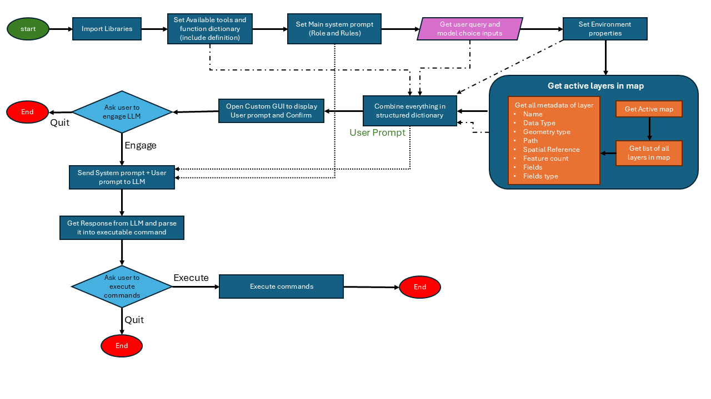
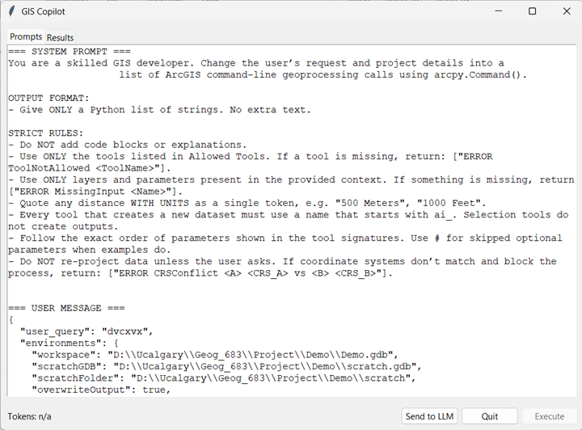
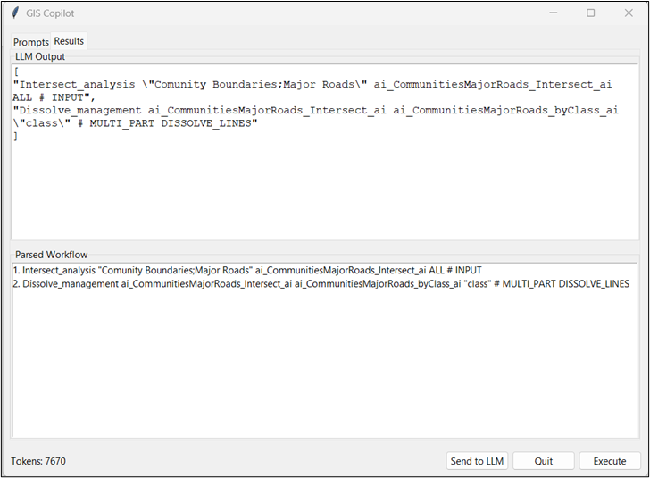
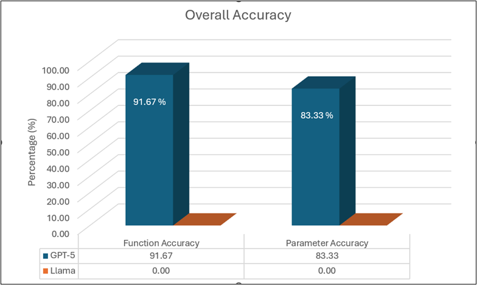
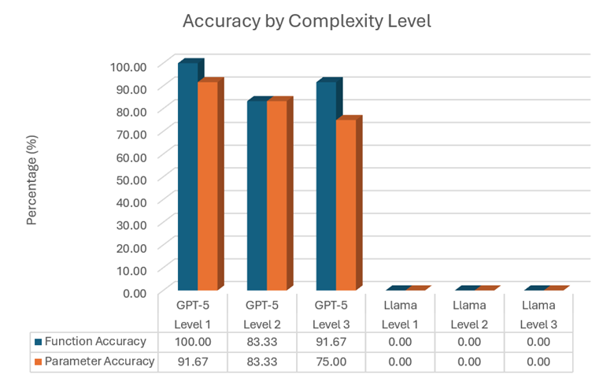

# Geo Copilot: Natural Language Geoprocessing Tool for ArcGIS Pro

Geo Copilot is an ArcGIS Pro script tool that allows users to perform geoprocessing tasks using natural language prompts.

The main idea of this project was to test whether a Large Language Model (LLM) can understand a user's GIS request, read the active ArcGIS Pro map context, choose the correct geoprocessing tools, generate executable ArcPy commands, and let the user review the workflow before running it.

This was developed as my final MGIS project at the University of Calgary. The project focuses on integrating LLMs into ArcGIS Pro to make common GIS workflows easier for users who may not be comfortable with scripting or manually chaining multiple geoprocessing tools.

## Project Overview

Geo Copilot works as a controlled natural-language GIS assistant inside ArcGIS Pro.

The user provides:

- A natural language GIS task
- A model choice, such as GPT or a local Llama model

The tool then:

1. Reads the active map in ArcGIS Pro
2. Collects metadata about all active layers
3. Builds a structured prompt containing the user query, map environment, available tools, and layer metadata
4. Sends the prompt to the selected LLM
5. Receives a list of executable ArcGIS geoprocessing commands
6. Shows the raw LLM response and parsed workflow in a custom Tkinter GUI
7. Allows the user to approve or reject the workflow
8. Executes approved commands using `arcpy.Command()`

The project was designed as an academic prototype, not a production-ready commercial tool.

## Workflow Diagram

The flowchart below shows the overall execution logic of Geo Copilot.



The workflow starts by importing required libraries, setting the available tools and system prompt, collecting the user query and model choice, extracting active map/layer metadata, combining everything into a structured user prompt, sending it to the selected LLM, parsing the returned commands, and executing them only after user approval.

## Why I Built This Project

GIS software is powerful, but it can be difficult for new users because many tools require knowing the correct tool name, input layer, output location, parameter order, and tool sequence.

This project was created to explore whether natural language could make GIS workflows easier.

For example, instead of manually finding and running multiple tools, the user could write:

```text
Buffer all schools by 500 meters and clip the result to the city boundary.
```

Geo Copilot then tries to convert this request into valid ArcGIS geoprocessing commands.

The goal was not to replace GIS knowledge completely. The goal was to test how LLMs can support GIS users and reduce the gap between user intent and technical geoprocessing steps.

## Main Features

- Runs inside ArcGIS Pro as a script tool
- Accepts natural language GIS requests
- Supports GPT-based API model calls
- Supports a local Llama model through Ollama
- Reads active map context from ArcGIS Pro
- Extracts layer metadata, geometry type, spatial reference, and field information
- Provides a controlled list of allowed ArcGIS geoprocessing tools
- Uses a strict system prompt to reduce hallucination
- Displays prompts and LLM output in a custom Tkinter GUI
- Parses LLM output into executable command strings
- Lets the user review commands before execution
- Executes approved commands using `arcpy.Command()`
- Compares model performance using function accuracy and parameter accuracy

## ArcGIS Pro Tool Interface

The tool starts from the normal ArcGIS Pro geoprocessing pane. The user enters a GIS task and selects which model to use.


This keeps the workflow familiar for ArcGIS Pro users. The ArcGIS geoprocessing pane is only used to collect the initial inputs. After that, Geo Copilot opens a custom Tkinter window for prompt review and command execution.

## Prompt Review Window

After the user runs the tool, Geo Copilot opens a custom Tkinter GUI. The first tab shows the full system prompt and user message before anything is sent to the LLM.



This was added because I wanted the user to see what information is being sent to the model. The user prompt includes the current workspace, scratch workspace, map units, active layers, field names, spatial references, and the allowed geoprocessing tools.

This makes the tool more transparent and gives the user more control.

## LLM Output and Parsed Workflow

After the user sends the prompt to the model, the Results tab shows the raw LLM output and the parsed workflow.



The top section shows the exact response returned by the LLM. The bottom section shows the parsed workflow in a cleaner format.

The user can review the commands before clicking **Execute**. This is important because LLM-generated workflows should not run automatically without user approval.

## Tools and Technologies Used

| Category | Tools / Libraries |
|---|---|
| GIS Software | ArcGIS Pro |
| GIS Automation | ArcPy |
| AI / LLM Access | OpenAI API, Ollama |
| Local LLM | Llama |
| GUI | Tkinter |
| Data Format | JSON |
| Programming Language | Python |
| Evaluation | Manual workflow comparison, accuracy scoring, McNemar's test, Spearman correlation |

## Folder Structure

```text
arcgis-geo-copilot-llm/
│
├── README.md
├── .gitignore
│
├── scripts/
│   └── geo_copilot.py
│
├── toolbox/
│   └── AI_Tools.atbx
│
├── docs/
│   └── final-report-summary.md
│
└── screenshots/
    ├── Flowchart.png
    ├── Tool GUI.png
    ├── prompts.png
    ├── Results.png
    ├── chart2.png
    └── chat1.png
```

## How Geo Copilot Works

### 1. Getting the Active Map

Geo Copilot first gets the active map from the currently open ArcGIS Pro project.

This is important because the LLM should not guess which layers exist. It should only use layers that are actually present in the user's active map.

```python
aprx = arcpy.mp.ArcGISProject("CURRENT")
mp = aprx.activeMap
```

### 2. Reading Layer Metadata

For every layer in the active map, the tool collects metadata such as:

- Layer name
- Geometry type
- Spatial reference name
- Spatial reference WKID
- Field names
- Field data types

This helps the LLM understand the available data before generating commands.

### 3. Defining Allowed Tools

Geo Copilot does not allow the LLM to use every ArcGIS tool freely. Instead, a controlled dictionary called `ALLOWED_TOOLS` defines which tools are available.

Examples include:

- `Buffer_analysis`
- `Clip_analysis`
- `Intersect_analysis`
- `Dissolve_management`
- `SelectLayerByAttribute_management`
- `SelectLayerByLocation_management`
- `CopyFeatures_management`
- `SpatialJoin_analysis`
- `Erase_analysis`
- `Union_analysis`
- `AddField_management`
- `CalculateField_management`

Each tool definition includes:

- Tool name
- Expected parameter order
- Example usage
- Output parameter position

This makes the LLM response more controlled and reduces hallucination.

## Allowed Tools Example

Example structure from the tool dictionary:

```python
"Buffer_analysis": {
    "signature": "Buffer_analysis in_features out_feature_class buffer_distance_or_field {line_side} {line_end_type} {dissolve_option} {dissolve_field} {method}",
    "example": 'Buffer_analysis BikeShops_Geocoded_1 BikeShops_Buffer500m_ai "500 Meters" FULL ROUND ALL # PLANAR',
    "out_index": 2,
}
```

The purpose of this structure is to guide the LLM so it knows the correct command format.

## System Prompt

The system prompt tells the LLM to behave like a GIS developer and return only a Python list of strings.

The LLM is instructed to:

- Use only allowed tools
- Use only layers available in the active map
- Avoid explanations
- Avoid code blocks
- Return only executable command strings
- Use correct parameter order
- Use output names starting with `ai_`
- Not re-project data unless the user asks for it
- Report missing inputs or coordinate system conflicts when needed

This strict prompt design was important because early tests showed that LLMs can easily return paragraphs, explanations, or incorrect formats if the rules are not clear.

## User Prompt

The user prompt is generated dynamically every time the tool runs.

It includes:

- User's natural language query
- Active workspace
- Scratch geodatabase
- Scratch folder
- Overwrite output setting
- Active map units
- Active layer metadata
- Allowed tool definitions
- Naming rules
- Spatial reference rules

This means the prompt changes depending on the active ArcGIS Pro project and map.

## Custom Tkinter GUI

Geo Copilot uses a custom Tkinter window after the user runs the ArcGIS Pro script tool.

The GUI has two main tabs:

### Prompts Tab

This tab shows:

- System prompt
- User prompt
- Map context
- Tool definitions

This allows the user to inspect what will be sent to the LLM.

### Results Tab

This tab shows:

- Raw LLM response
- Parsed workflow
- Commands that will be executed

The user can then choose whether to execute or quit.

This was added because LLM-generated workflows should not run automatically without user review.

## Command Execution

If the user approves the workflow, the tool runs each command using:

```python
arcpy.Command(cmd)
```

This allows Geo Copilot to execute ArcGIS geoprocessing tools from string commands generated by the LLM.

## Model Testing

The project tested two types of LLM approaches:

1. A commercial GPT model
2. A locally hosted Llama model

The testing used 36 GIS queries. These queries were divided into three complexity levels:

| Complexity Level | Description |
|---|---|
| Level 1 | One geoprocessing tool |
| Level 2 | Two geoprocessing tools |
| Level 3 | More than two geoprocessing tools |

Each query was first completed manually to create a reference workflow. Then both models were tested against the same queries.

Two accuracy metrics were used:

| Metric | Meaning |
|---|---|
| Function Accuracy | Whether the model selected the correct geoprocessing tool sequence |
| Parameter Accuracy | Whether the model selected the correct input layers, outputs, distances, fields, and other parameters |

## Results Summary

In the final project testing, GPT performed strongly.

| Model | Function Accuracy | Parameter Accuracy |
|---|---:|---:|
| GPT | 91.67% | 83.33% |
| Llama | 0% | 0% |

GPT selected the correct geoprocessing functions in 33 out of 36 test queries and selected correct parameters in 30 out of 36 test queries. The local Llama model did not produce valid parseable workflows in the tested setup.

## Overall Accuracy Chart

The chart below shows the overall comparison between GPT and the local Llama model.



GPT achieved much higher performance for both function accuracy and parameter accuracy. Llama did not produce valid parseable workflows in this test setup.

## Accuracy by Complexity Level

The chart below shows accuracy results divided by query complexity level.



GPT performed well across all three complexity levels. Function accuracy stayed high even for more complex workflows, but parameter accuracy decreased slightly as the workflows became more complex.

This makes sense because longer workflows require the model to correctly identify more layers, distances, field names, output names, and tool parameter order.

## Important Note About Llama Results

The Llama result should be interpreted carefully.

The local Llama model failed in this project, but this does not mean that all local LLMs are unsuitable for GIS workflows. One major limitation was system resources. Due to hardware constraints, I was only able to test a small local model with about 3 billion parameters. A smaller model has much weaker instruction-following and reasoning ability compared with larger commercial models.

Because of this, the comparison is somewhat biased in favour of GPT. GPT was much more capable, while the local model was limited by the available hardware.

However, the local LLM test was still useful because it showed an important direction for future GIS tools. If enough system resources are available, local LLMs could be useful for privacy-focused GIS workflows because the data and prompts can stay on the user's own machine instead of being sent to an external API.

This is especially important for GIS projects involving:

- confidential client data
- government data
- sensitive infrastructure data
- private property data
- internal organizational datasets

So even though the tested local Llama model failed, the idea of using local LLMs for private GIS automation is still valuable.

## Statistical Evaluation

The project also used statistical testing to compare the two models.

McNemar's test was used because both models were tested on the same set of queries.

The results showed that GPT performed significantly better than the local Llama model for both:

- function selection accuracy
- parameter accuracy

Spearman correlation was also used to check whether query complexity affected GPT accuracy. The results showed no statistically significant monotonic relationship between complexity level and GPT accuracy, although parameter accuracy did decrease slightly as workflows became more complex.

## Example Queries

Some example test queries included:

```text
Buffer all schools by 500 meters.
```

```text
Extract only the portion of water bodies that fall within the city boundary.
```

```text
Buffer all communities by 500 meters and clip the result to the city boundary.
```

```text
Create a 500 meter buffer around schools, intersect with communities, and dissolve by Authority_type.
```

```text
Select elementary schools, select those within 500 meters of major roads, and copy the selection.
```

## Example LLM Output

For a query like:

```text
Intersect communities with major roads and dissolve the result by class.
```

The LLM output may look like:

```python
[
  "Intersect_analysis \"Community Boundaries;Major Roads\" ai_CommunitiesMajorRoads_Intersect_ai ALL # INPUT",
  "Dissolve_management ai_CommunitiesMajorRoads_Intersect_ai ai_CommunitiesMajorRoads_byClass_ai \"class\" # MULTI_PART DISSOLVE_LINES"
]
```

The tool then parses this list and shows it in the GUI before execution.

## Current Limitations

This project is an academic prototype and has limitations.

- The OpenAI API key must be handled through environment variables and should never be hardcoded.
- The local Llama model used in testing was too small to reliably follow strict tool-use instructions.
- The list of available geoprocessing tools is manually defined in the source code.
- The user needs ArcGIS Pro and ArcPy to run the tool.
- The tool only works with the active map in ArcGIS Pro.
- Some workflows can fail if input layers have incompatible coordinate systems.
- The tool does not yet automatically fix projection issues.
- The LLM can still make mistakes in parameter order or workflow design.
- The GUI is functional but still basic.
- The tool is not production-ready and should be used carefully.

## Security Note

Do not hardcode API keys in the script.

For public GitHub, the OpenAI client should be initialized without exposing a key:

```python
client = OpenAI()
```

Then set the API key as an environment variable before running the tool.

Example in PowerShell:

```powershell
$env:OPENAI_API_KEY="your_api_key_here"
```

This keeps the API key outside the code.

## How to Use

1. Open ArcGIS Pro.
2. Open a project with the layers you want to use.
3. Make sure the correct map is active.
4. Add the toolbox from the `toolbox` folder.
5. Open the Geo Copilot script tool.
6. Enter a natural language GIS task.
7. Select the model.
8. Run the tool.
9. Review the prompt in the Tkinter window.
10. Click **Send to LLM**.
11. Review the raw output and parsed workflow.
12. Click **Execute** only if the workflow looks correct.

## Example Natural Language Input

```text
Buffer all schools by 500 meters and clip the result to the city boundary.
```

Expected style of LLM output:

```python
[
  "Buffer_analysis Schools ai_schools_buffer_500m \"500 Meters\" FULL ROUND ALL # PLANAR",
  "Clip_analysis ai_schools_buffer_500m City_Boundary ai_schools_buffer_city_ai"
]
```

## Future Improvements

Future improvements could include:

- Adding more ArcGIS geoprocessing tools
- Creating a GUI for users to add tools without editing code
- Supporting larger local LLMs
- Improving local model prompting
- Adding automatic validation before execution
- Adding better projection handling
- Adding logging of prompts and outputs
- Adding a safer command preview system
- Supporting multi-turn conversation
- Supporting tool correction when execution fails
- Testing with more datasets
- Testing with more open-source LLMs
- Improving the Tkinter interface
- Adding a proper ArcGIS Pro add-in version

## Skills Demonstrated

This project demonstrates:

- ArcGIS Pro automation
- ArcPy scripting
- LLM integration with GIS software
- Prompt engineering
- Natural language geoprocessing
- Tool-use workflow design
- Map context extraction
- Metadata extraction from GIS layers
- Tkinter GUI development
- JSON prompt construction
- Model evaluation
- Accuracy testing
- GIS workflow automation
- Research-style project design

## Notes

This project was developed as a final MGIS project. It was built mainly to explore how LLMs can be integrated into ArcGIS Pro for geoprocessing automation.

The project shows that LLMs can support GIS workflows when they are given enough map context, tool definitions, and strict output rules. It also shows that local LLMs are promising for privacy, but they require enough computing power and a capable model to perform well.